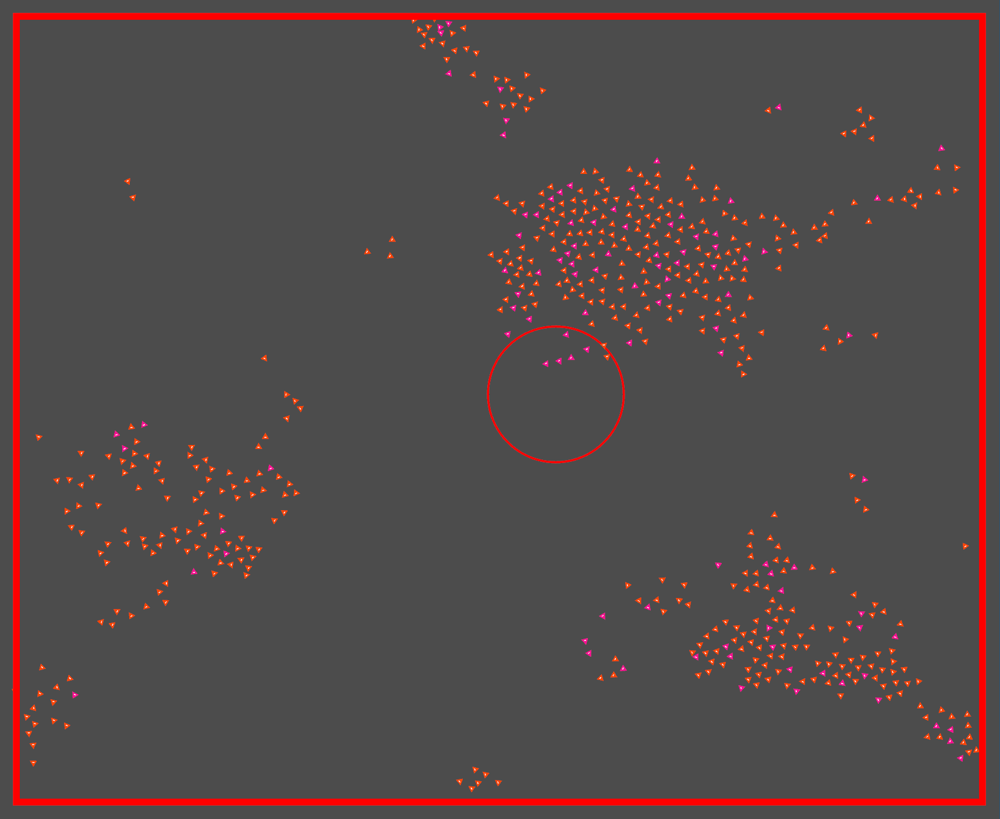

# autonomous-characters

## Possible improvements

- Add Egui Menu for changing different parameters
- Implement [Octree](https://en.wikipedia.org/wiki/Octree)

## Info

- This was a small school project for an exercise in a class

- Built in couple of days

## New things I learned

- Bevy
- Basics of Rayon (parallel iterators)

## Info for running

- Hold `space` to spawn more characters
- Hold `left mouse button` to give the vehicles a target

### Showcase

